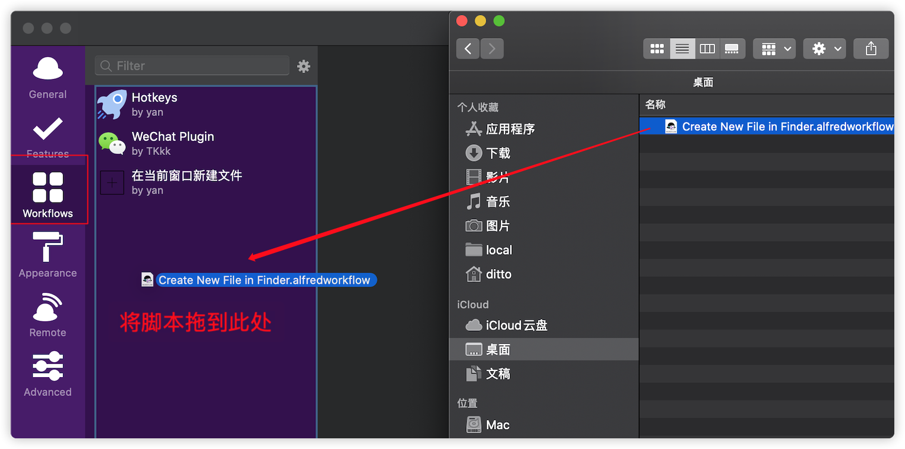
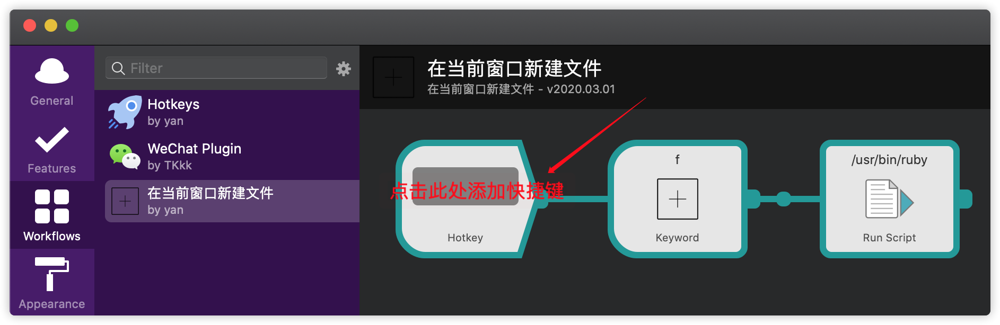
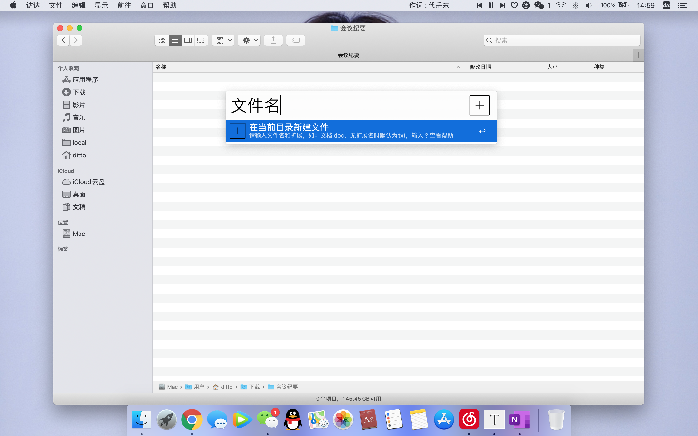
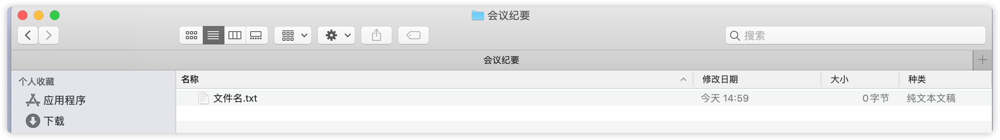
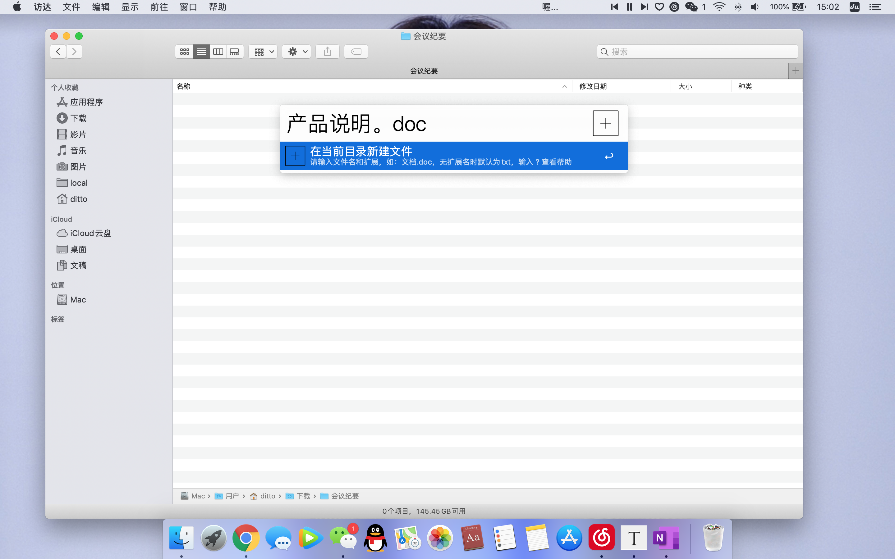

# 苹果 Mac 在当前窗口新建文件

Windows、Linux-Centos7等系统，都可以很方便的用鼠标右键在当前目录新建文件、打开命令窗口。

苹果 Mac OS 的[奥卡姆剃刀](https://baike.baidu.com/item/%E5%A5%A5%E5%8D%A1%E5%A7%86%E5%89%83%E5%88%80%E5%8E%9F%E7%90%86/10900565?fr=aladdin)设计，使得当前目录新建文件、打开命令行等操作非常繁琐。

## 一、安装

##### 步骤一：安装Afred

​		此文解决方案是使用Afred的工作流 Workflow，依耐 Afred 运行。可参照：

​		[MAC必备效率工具Alfred的介绍](https://www.jianshu.com/p/cf16b2c973e9)

​		[MAC必备效率工具Alfred的一键式安装](https://www.jianshu.com/p/d21f8302f70f)

##### 步骤二：下载此脚本拖动到 Afred 插件中，并为将此脚设置启动快捷键

  如快捷键可以设置为：alt + f（单手操作方便，且见名知意——File）

## 二、使用说明

按下设置的快捷键后

第一种：直接输入文件名，默认生成txt格式空文件。

第二种：指定格式：输入要使用的文件名和扩展名。(如：文档.txt,)

​				为避免来回切换输入法，句号“。”自动识别为扩展分隔符"." 

​				例：
​						输入：产品说明。doc
​						将自动识别为：产品说明.doc

第三种：如果不输入任何内容，直接按下回车，默认在当前目录创建：新建文件.txt

效果图：

